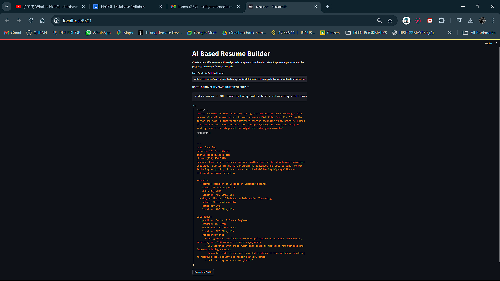
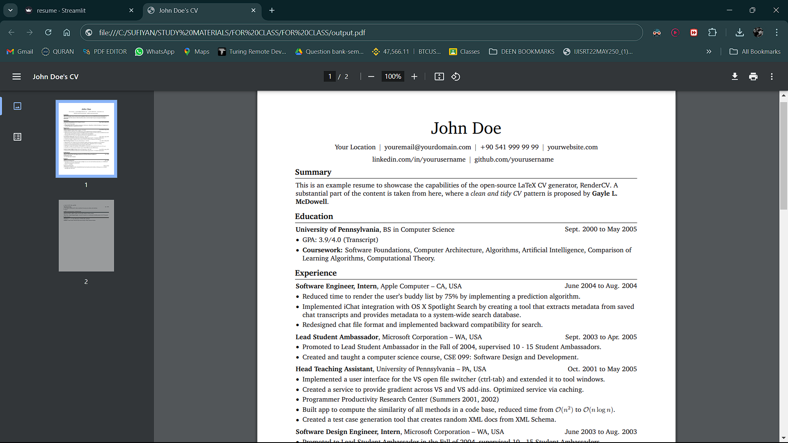

# AI- Based Resume Builder

Welcome to the AI Based Resume Builder project! This project leverages cutting-edge AI technology to help you create a professional resume in minutes. By using OpenAI's language model, the application generates a complete resume in YAML format, which can be easily downloaded and used for your job applications.

## Project Overview

The AI Based Resume Builder consists of two main components:

1. **`model.py`**: Contains the logic for generating resume content using OpenAI's language model.
2. **`resume.py`**: A Streamlit application that provides an easy-to-use interface for users to input their information and generate a resume.

# Screenshot

Final Output

Thank you for checking out my project!
